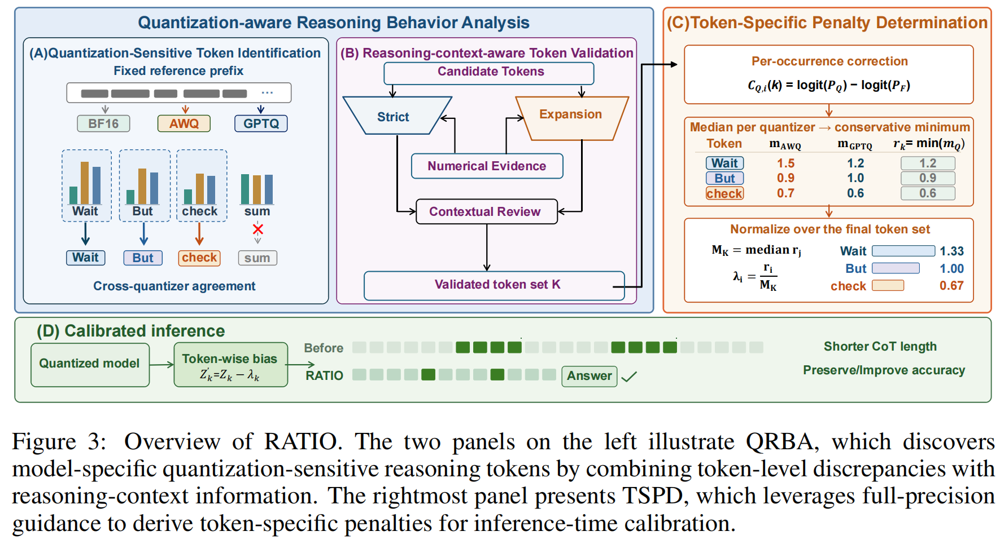
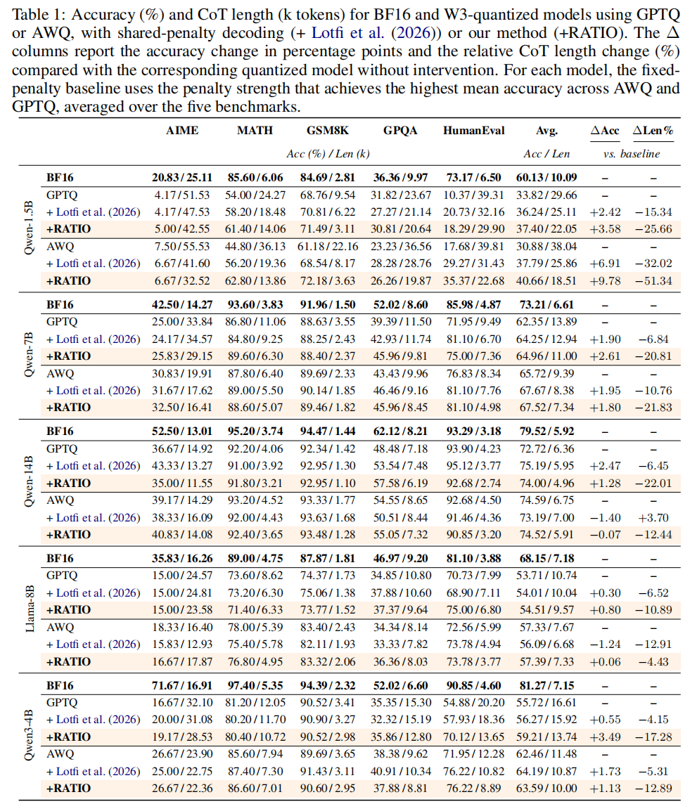

# RATIO: Reasoning Analysis and Token-level Inference Optimization for Quantized Reasoning Models

  
  
  

---

#### 🔥 News

- **2026-09-29:** This repository is officially released!

---

> **Abstract:** Post-training quantization (PTQ) has become a widely adopted technique for reducing the memory footprint and inference cost of large language models (LLMs). However, recent studies reveal that when applied to reasoning models, PTQ not only degrades reasoning performance but also exacerbates overthinking, leading to longer reasoning trajectories. These issues may offset the efficiency gains expected from lower-precision inference. Existing approaches to mitigating these problems mainly rely on complex optimization procedures. More recent lightweight inference strategies instead use predefined overthinking markers, limiting their adaptability across quantized models. To address these issues, we propose **Reasoning Analysis and Token-level Inference Optimization (RATIO)**, a framework that identifies model-specific overthinking tokens and assigns each a tailored penalty. RATIO first introduces **Quantization-aware Reasoning Behavior Analysis (QRBA)** to identify overthinking tokens by analyzing discrepancies between full-precision and quantized models. It then adopts **Token-Specific Penalty Determination (TSPD)**, which leverages full-precision guidance to derive token-specific penalties without additional training. Extensive experiments show that RATIO achieves a better accuracy-efficiency trade-off than existing token-level interventions. Specifically, RATIO achieves up to **9.8 percentage points accuracy improvement** and reduces chain-of-thought (CoT) length by up to **51.3%** compared with quantized baselines. We will release all the code and implementation of RATIO.

  

---

## ⚒️ TODO

- [ ] Complete this repository

## 🔗 Contents

- [ ] Quantization-aware Reasoning Behavior Analysis (QRBA)
- [ ] Token-Specific Penalty Determination (TSPD)
- [ ] [Results](#results)
- [ ] [Citation](#citation)
- [ ] [Acknowledgements](#acknowledgements)

## 🔎 Results

RATIO reduces CoT length while generally preserving or improving reasoning accuracy across AIME, GPQA-Diamond, MATH-500, GSM8K, and HumanEval under AWQ-W3 and GPTQ-W3 quantization.

📊 Click to view the full experimental results

  

## Citation

The paper link and BibTeX citation will be added once available.

## 💡 Acknowledgements

We thank the teams behind DeepSeek-R1, Qwen, Llama, AWQ, and GPTQ, as well as the creators of the evaluation benchmarks, for their contributions to open research.
